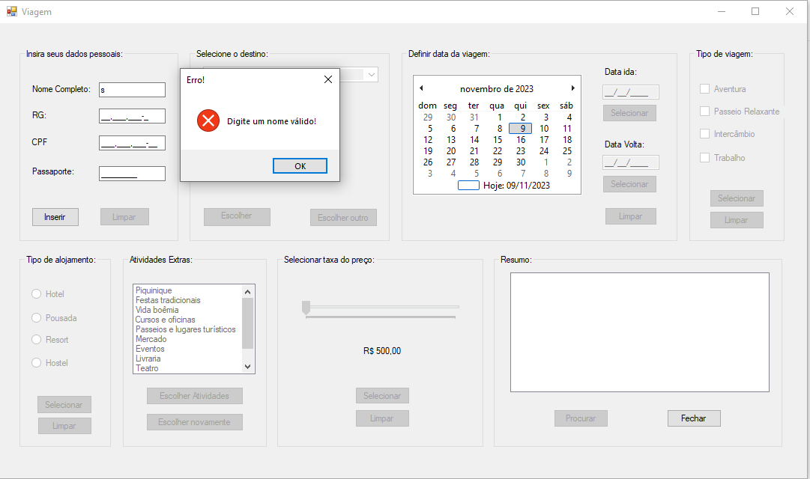

# projetoViagens-CSharp
projeto feito com C# no visual studio. um básico para treinar lógica. Etec de Guarulhos.
  

  <h3>A tela do programa</h3>
  

  

  <h3>Ele tem validações em todas as partes dele</h3>
   

  

  <h3>Preenchido ele fica assim e dá um erro porque sim</h3>
  

